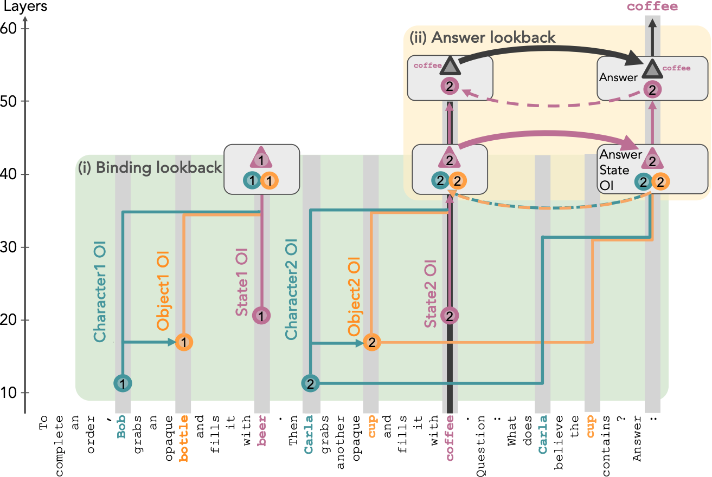

# Language Models use Lookbacks to Track Beliefs

This repository contains the code and experiments for the paper ["Language Models use Lookbacks to Track Beliefs"](https://arxiv.org/abs/2505.14685) by Prakash et al. The work investigates how language models (specifically Llama-3-70B-Instruct) represent and track characters' beliefs usin





Please check [belief.baulab.info](https://belief.baulab.info/) for more information.

## Setup

1. Clone the repository:
```bash
git clone https://github.com/Nix07/mind.git
cd mind
```

2. Set up the environment:
```bash
conda env create -f environment.yml
conda activate mind
```

3. Configure `env.yml` with following environment variables:
- Set `NDIF_KEY` for API access
- Set `HF_WRITE` for Hugging Face access

4. Download the singular vectors tensors from [here]().


## Repository Structure

```
.
├── 📊 data/                              # Dataset files
├── 🧪 experiments/                       # Experiment configurations and results
│   ├── attn_knockout/                   # Attention knockout implementation
│   ├── bigToM/                          # BigToM causal model experiments 
│   ├── causal_mediation_analysis/       # Tracing experiments
│   ├── causal_subspace_analysis/        # Causal subspace analysis
│   ├── causalToM_novis/                 # Causal model in no-visibility
│   └── causalToM_vis/                   # Causal model in explicit visibility   
├── 📜 scripts/                          # Utility scripts
├── 🔧 src/                              # Source code
├── 📐 svd/                              # Singular vectors
└── ⚙️ env.yml                           # Environment configuration
```

## Usage

The repository contains several components:

1. **Dataset**: The `data/` contains the CausalToM templates and synthetic entities used to generate samples. Additionally, it also contains BigToM samples. `src/dataset.py` file contains code for generating and processing the CausalToM dataset.

2. **Experiments**: The `experiments/` directory contains configurations and results for various experiments investigating the underlying mechanisms. Use notebooks in `experiments/causalToM_novis` and `experiments/causalToM_vis` for mechanism exploration. Use `scripts/run_single_layer_patching_exps.py` and `scripts/run_single_layer_patching_exps.py` with appropriate arguments to scale up the interchange intervention experiments for mechanism discovery.

3. **Utilities**: Utilities are included in their respective directories.

## Citation

If you use this code in your research, please cite our paper:

```bibtex
@misc{prakash2025languagemodelsuselookbacks,
      title={Language Models use Lookbacks to Track Beliefs}, 
      author={Nikhil Prakash and Natalie Shapira and Arnab Sen Sharma and Christoph Riedl and Yonatan Belinkov and Tamar Rott Shaham and David Bau and Atticus Geiger},
      year={2025},
      eprint={2505.14685},
      archivePrefix={arXiv},
      primaryClass={cs.CL},
      url={https://arxiv.org/abs/2505.14685}, 
}
```

## Contact

For questions and issues, please open an issue in this repository or contact [Nikhil](https://nix07.github.io/). 